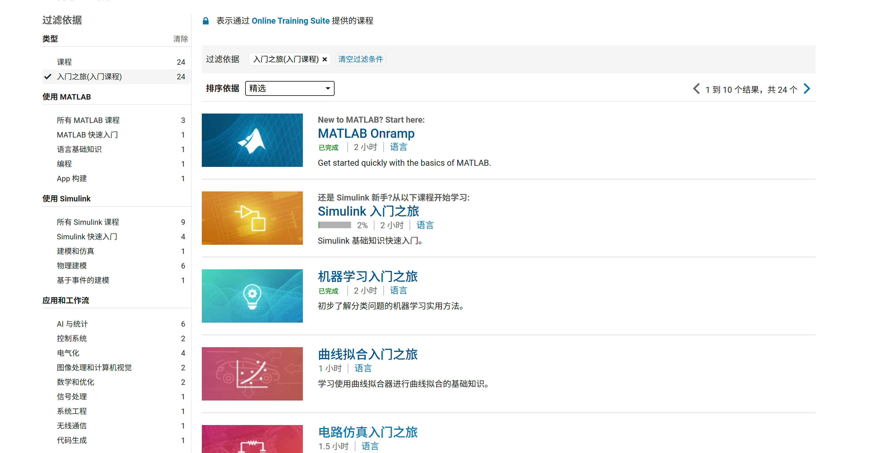
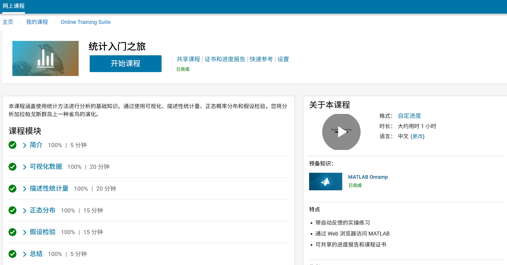
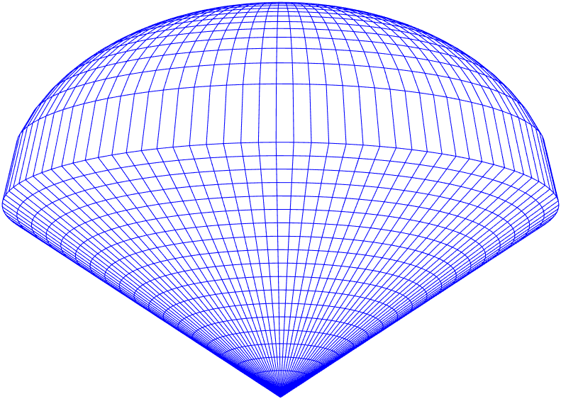

# 【MATLAB】Matlab快速入门01——MATLAB简介
> 本系列是MATLAB快速入门的学习笔记，旨在记录我的学习历程，方便后续查阅。若能帮到你，我倍感荣幸。践行费曼学习法，公开分享，欢迎交流指正！

MATLAB是一款强大的数学计算软件，在工程、科学和数学领域应用广泛。它提供丰富的工具箱和函数库，支持数值计算、数据分析和可视化等。相信你点开本文，已对MATLAB有所了解，此处就不再赘述其官方介绍了。

学习软件或编程语言，我认为可分为两步：**1. 熟悉基本操作和语法；2. 选择感兴趣的领域直接实践。** 切勿在基础语法上过度纠结，达到“能跑通代码、看懂他人大部分代码”即可。基础会在实践中不断巩固。**最关键的是动手！看百遍不如写一行。** 本系列将快速带你过一遍MATLAB基础，助你尽快投入实战。

## 1. MATLAB：强大的商业软件

首先要明确：**MATLAB是一款商业软件**，使用需购买许可证。这既是它的“缺点”（需要成本），也是其核心“优点”（保证了专业支持和生态质量）。

提到这点，常会对比当下热门的**Python**。Python免费开源，社区庞大。两者之争常被热议。我的体验总结为：**MATLAB胜在省心省力，Python赢在免费灵活。**

*   **MATLAB的“省心省力”**：海量专业工具箱开箱即用，用户常感如同使用超级计算器或专业软件，通过高效调用函数甚至图形界面操作就能完成复杂任务。其**“核武器级别”的帮助文档**更是核心竞争力——详尽、规范、易查。构建和维护如此高质量的文档体系，是MathWorks深厚的护城河，也是很多开源项目难以企及的。
*   **Python的“免费灵活”**：零成本入门，活跃社区提供了海量免费第三方库，应用领域极其广泛。但库的质量、维护状态和文档风格参差不齐是常见挑战。好在社区力量强大，“没有轮子？自己造！”也是Python的魅力所在。

## 2. 正版使用之道：拥抱MATLAB Online

作为商业软件，常规使用需许可证（通常由学校或公司提供）。**本文重点推荐一个合法、免费（或低成本）的正版使用途径：MATLAB Online！**

MathWorks 提供了在线版 MATLAB，直接通过浏览器即可使用。注册一个免费的 MathWorks 账号，你就有两种选择：

*   **MATLAB Online (完整版 - 推荐有条件者使用)：** 如果你是在校师生或科研机构人员，很可能通过机构的“全校授权”(Campus-Wide License) 获得完整版在线 MATLAB 的使用权。使用机构邮箱注册并关联许可证即可。部分许可证还包含技术支持。
*   **MATLAB Online (基础版 - 免费！)：** 每月免费提供 **20 小时**使用时间，可使用 **MATLAB + 10 款常用产品**（如Simulink）。非常适合学习、运行基础代码或他人分享的模型。**注册即用！**

> 📌 **访问与信息：** 详情请参阅 [MathWorks MATLAB Online 官网](https://www.mathworks.com/products/matlab-online.html)
>  

### 💡 实用技巧：突破基础版限制

*   **试用期：** 免费账号可申请 **30 天完整版试用**，体验所有功能。**(提示：需使用有效邮箱注册)**
*   **“学习式白嫖”：** 善用 MathWorks 官网提供的**免费在线课程**！这些课程不仅用于学习，其附带的练习环境在课程结束后**通常可持续使用**，且**不限时**！这是进行长期实践的绝佳方式。

     *(图：MathWorks 在线课程列表 )*
     *(图：例如“统计入门”课程环境 -)*
    在课程环境中，你完全可以运行自己的代码进行探索。例如，下面的代码在课程环境里就能画出一个漂亮的“冰淇淋锥体”：

```matlab
% MATLAB 可视化示例：绘制冰淇淋锥体
clf; clear; clc; % 清空图形、工作区、命令窗口
m = 20; n = 100; % 网格密度
t = linspace(0, 2*pi, n); % 角度范围 [0, 2π]
r = linspace(0, 1, m); % 半径范围 [0, 1]
% 生成锥体底部网格坐标
x = r.' * cos(t);
y = r.' * sin(t);
z1 = sqrt(x.^2 + y.^2); % 锥体高度
% 生成半球体(冰淇淋)网格坐标 (添加eps避免除零)
z2 = 1 + sqrt(1 + eps - x.^2 - y.^2);
% 合并锥体和半球体坐标
X = [x; x];
Y = [y; y];
Z = [z1; z2];
% 绘制网格曲面
mesh(X, Y, Z);
view(0, -18); % 设置视角
colormap([0 0 1]); % 设置为蓝色
axis off; % 关闭坐标轴
```
 *(冰激凌锥体 )*

后续计划： 本系列教程将主要基于 MATLAB Online (基础版试用版) 来讲解基础操作和语法。其界面和功能与本地版 MATLAB 高度一致，学习体验无缝衔接。准备好，我们马上进入MATLAB的世界吧！
