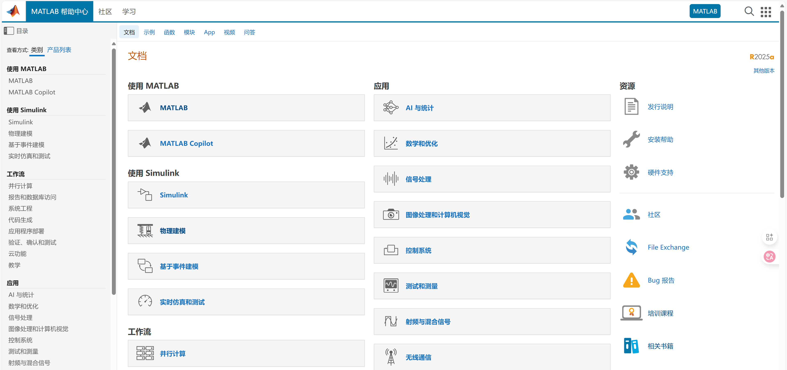
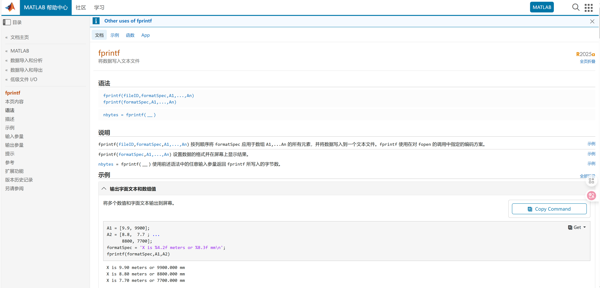

# 【MATLAB】Matlab快速入门02——学习资料和操作

> 本系列是MATLAB快速入门的学习笔记，旨在记录学习历程，方便后续查阅。若能帮到你，我倍感荣幸。践行费曼学习法，公开分享，欢迎交流指正！

上篇介绍了[MATLAB正版白嫖攻略](Matlab快速入门01.md)，本篇解锁两大核心技能：**如何高效学习** + **如何动手操作**。  

## 1. 最好的学习资料：官方文档（你的24小时导师）  

> 💡 **学习铁律**：官方文档是任何技术的"源头活水"。
> MATLAB的文档堪称**教科书级标杆**——规范、完整、随软件预装，有实例代码，部分还存在参考文献。  

### 1.1 为什么官方文档是神？ 

- **权威准确**：MathWorks工程师撰写，随版本更新，避免二手资料错误  
- **深度用例**：每个函数都带应用场景示例（点击代码右上角"▲"直接运行）  
- **立体学习**：函数说明 → 语法详解 → 示例代码 → 相关函数推荐 闭环  

  
*(图：文档四大黄金分区 - 函数说明/语法/示例/See Also)*  

### 1.2 实战：`help` 和 `doc` 救命命令 

当遇到陌生函数（如`fprintf`），两种方式召唤文档：  

#### ✅ **快速提醒型**：`help`  
在命令行输入 `help fprintf`，30秒掌握核心用法：  
```matlab  
>> help fprintf  
 fprintf - 将数据写入文本文件
    此 MATLAB 函数 按列顺序将 formatSpec 应用于数组 A1,...An 的所有元素，并将数据写入
    到一个文本文件。fprintf 使用在对 fopen 的调用中指定的编码方案。

    语法
      fprintf(fileID,formatSpec,A1,...,An)
      fprintf(formatSpec,A1,...,An)

      nbytes = fprintf(___)  
```  

> 🚦 **适用场景**：忘记参数顺序时急救（比百度快10倍）  

#### ✅ **深度学习型**：`doc`  

输入 `doc fprintf` 打开完整文档页： 
*(图：`doc fprintf` 调出的帮助文档)*  

- 格式化符号大全（`%d`, `%f`, `\n`等）  
- 文件写入高级技巧  
- 与`sprintf`的区别对比  

通过`help` 和 `doc` 命令，我们就可以了解`fprintf`函数的使用，工作效率大大提高

如果官方文档还不能满足我们的需求，就可以考虑求助于AI，如deepseek、通义千问和豆包等。

### 1.3 免费官方课程：交互式学习  
文档太枯燥？试试 **MATLAB Onramp**（2小时免费互动课）：  
- 在官网中查找 `matlab-onramp`  
- 边学边练，实时检查代码正确性  
- 完成后颁发电子证书  

> 🎯 **学习心法**：  
> 遇到新函数时：  
> `help 函数名` → 跑通示例 → 修改参数观察变化 → `doc`深挖细节  →或求助AI

---  

## 2. MATLAB操作：从"懵逼"到"真香"  

> ⚙️ **设计哲学**：让工程师专注算法，而非记忆命令。  

### 2.1 界面解剖：四大工作区  
*(图：MATLAB操作界面)*
| 区域          | 作用                  | 快捷键         |  
|---------------|-----------------------|----------------|  
| **命令窗口**  | 执行单行代码          | `Enter`运行    |  
| **编辑器**    | 编写脚本/函数         | `Ctrl+S`保存   |  
| **工作区**    | 查看变量              | `Ctrl+Shift+W` |  
| **当前文件夹**| 管理文件              | `Ctrl+Shift+H` |  

> ✨ **灵魂功能**：  
> - **双击工作区变量**：可视化矩阵内容（再也不用`disp`打印大矩阵！）  
> - **拖拽文件到界面**：自动生成读取代码（对`csv`/`txt`神器）  

### 2.2 必会快捷键（效率翻倍）  
| 操作                | Windows快捷键     | Mac快捷键        |  
|---------------------|-------------------|------------------|  
| 运行当前节          | `Ctrl + Enter`    | `Cmd + Enter`    |  
| 注释/取消注释       | `Ctrl + R/T`        | `Cmd + /`        |  
| 自动补全函数        | `Tab`             | `Tab`            |  
| 查看函数历史        | `↑`/`↓`箭头       | `↑`/`↓`箭头      |  
| 清理命令行          | `Ctrl + L`        | `Cmd + L`        |  

### 2.3 新手通关项目：温度数据分析  
**任务**：读取某城市全年温度数据，统计月平均温度并可视化  

#### 步骤1：数据准备  
在工作目录创建 `temp_data.csv`：  
```csv  
% 创建CSV文件（复制到MATLAB命令行运行）
csv_data = {
    'Month,MinTemp,MaxTemp'
    'Jan,-5,10'
    'Feb,-3,12'
    'Mar,2,15'
    'Apr,8,20'
    'May,14,25'
    'Jun,18,28'
    'Jul,20,30'
    'Aug,19,29'
    'Sep,15,25'
    'Oct,9,20'
    'Nov,3,15'
    'Dec,-2,10'
};
fid = fopen('temp_data.csv', 'w');
fprintf(fid, '%s\n', csv_data{:});
fclose(fid);
disp('CSV文件创建完成！')  
```  

#### 步骤2：读取数据 → 探索 → 计算  
```matlab  
% 读取数据（试试拖拽文件到MATLAB界面！）  
data = readtable('temp_data.csv');  

% 探索数据（工作区双击data查看表格）  
avg_temp = (data.MinTemp + data.MaxTemp) / 2  %每月平均温度

max_temp = max(data.MaxTemp) %一年中最高气温
min_temp = min(data.MinTemp) %一年中最低气温 
```  

#### 步骤3：可视化结果  
```matlab  
% 绘制三条温度曲线
plot(data.MaxTemp, 'm-^', 'LineWidth', 1.5, 'MarkerSize', 8)  % 最高温 - 品红色上三角
hold on
plot(data.MinTemp, 'g-V', 'LineWidth', 1.5, 'MarkerSize', 8)  % 最低温 - 绿色下三角
plot(avg_temp, 'k-.', 'LineWidth', 2)                         % 平均温 - 黑色点划线

% 设置标题和坐标轴标签
title('全年温度变化趋势')  
xlabel('月份'), ylabel('温度(℃)')  

% 设置X轴刻度为全部月份
set(gca, 'XTick', 1:12, 'XTickLabel', data.Month)  % 关键修改：显示全部12个月份
set(gca, 'FontSize', 10)  % 增大字体确保可读性

% 添加参考线  
yline(0, 'r--', '冰点线', 'LineWidth', 2) % 红色虚线  

% 添加图例和网格
legend('最高温度', '最低温度', '平均温度', 'Location', 'best')
grid on

% 调整坐标范围使显示更美观
xlim([0.5, 12.5])  % 两边留出空间
ylim([min(data.MinTemp)-2, max(data.MaxTemp)+2]) % 上下留出空间

% 保存结果  
print('temp_plot', '-dpng', '-r300')  % 输出高清PNG图片(300dpi) 
```  

**最终效果**：  
*(图：温度分析图)*  

> 🧠 **操作心法**：  
> 1. 工作区双击变量 → 理解数据结构  
> 2. 遇到函数按`Tab` → 自动补全+提示参数  
> 3. `Ctrl+Enter`分节运行 → 调试不求人  
---

### 学习资料推荐
| 类型          | 资源                                                                 | 亮点                     |
|---------------|----------------------------------------------------------------------|--------------------------|
| **交互课程**  | [MATLAB Onramp](https://matlabacademy.mathworks.com/cn/details/matlab-onramp/gettingstarted) | 2小时零基础通关          |
| **文档技巧**  | [文档导航指南](https://ww2.mathworks.cn/help/?s_tid=user_nav_help)    | 官方搜索技巧大全         |
| **快捷键**    | [快捷键清单](https://ww2.mathworks.cn/help/matlab/matlab_env/accessibility-use-keyboard-shortcuts-to-navigate-matlab.html) | 打印贴墙效率翻倍         |
| **可视化**    | [绘图画廊](https://ww2.mathworks.cn/products/matlab/plot-gallery.html) | 500+专业可视化案例       |
